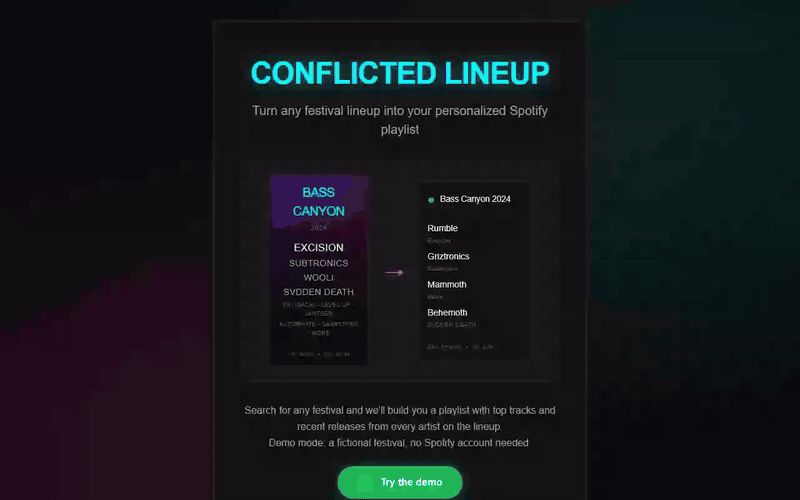
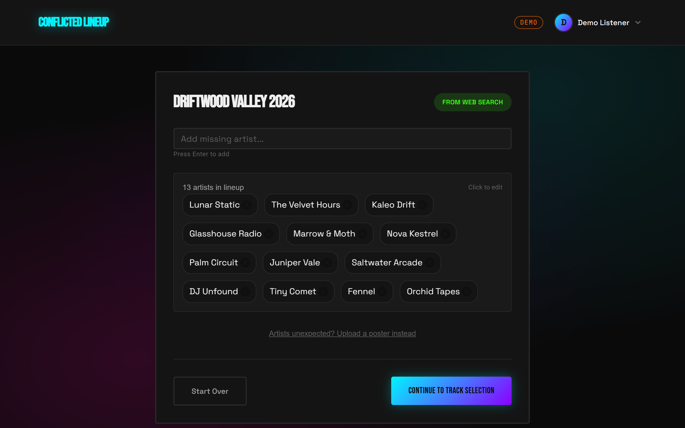
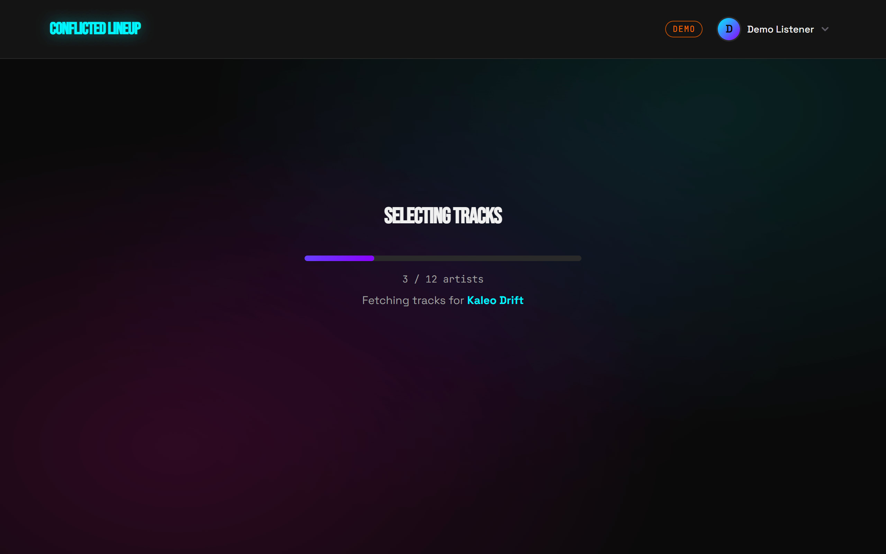
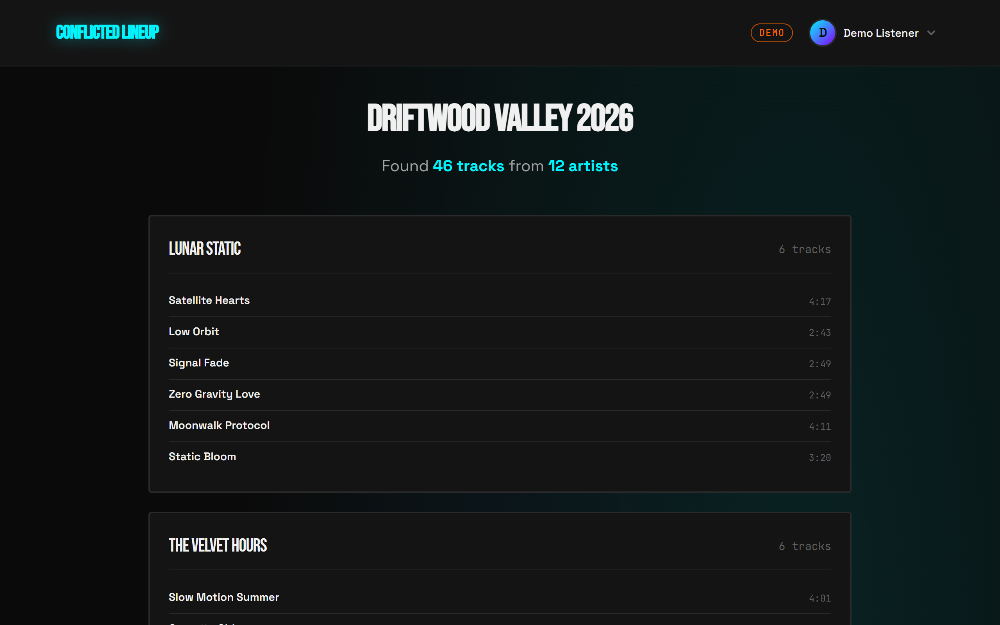
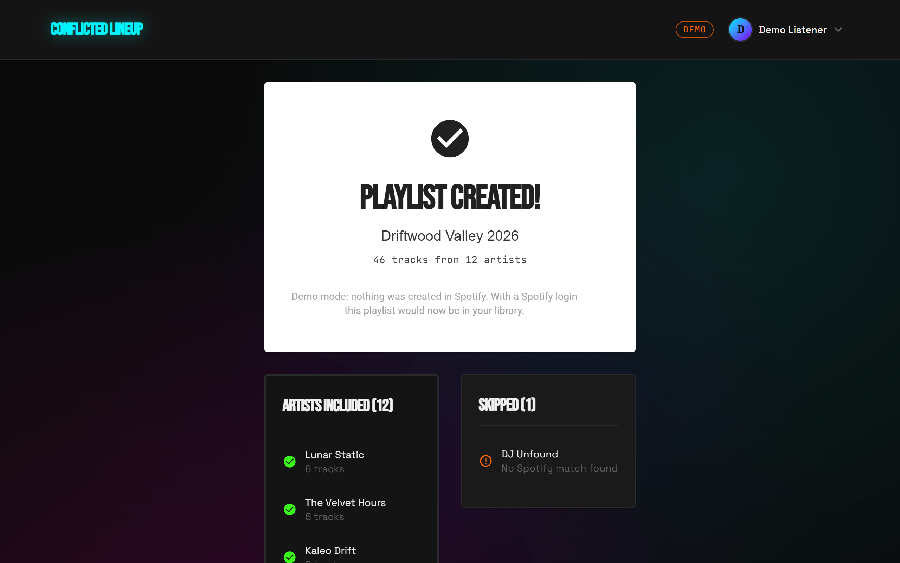
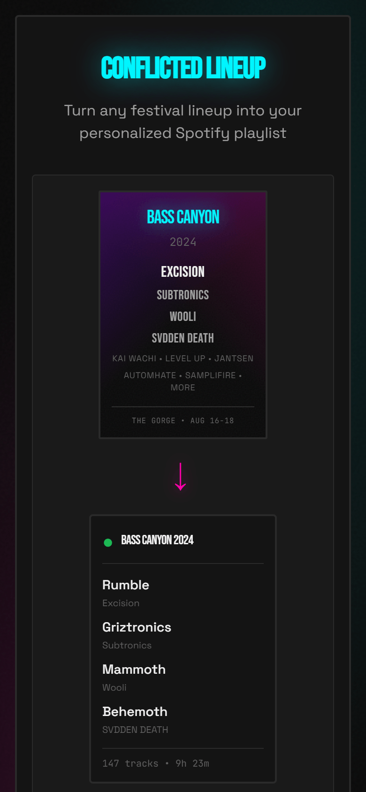
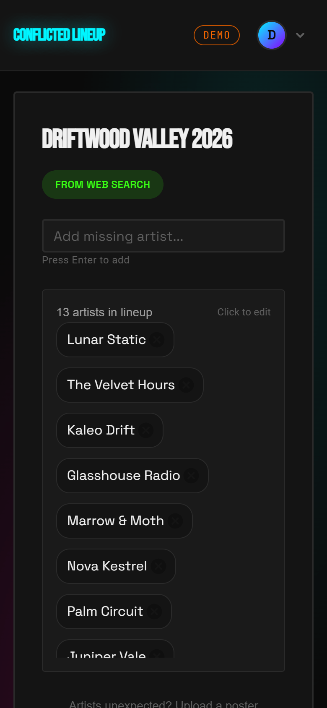
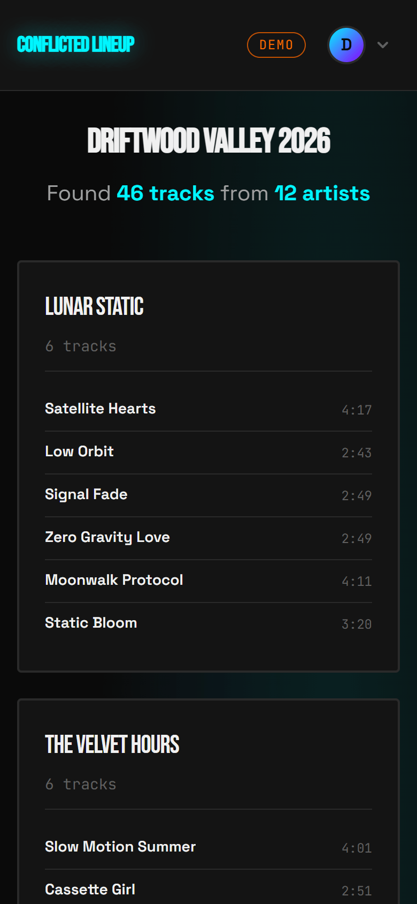
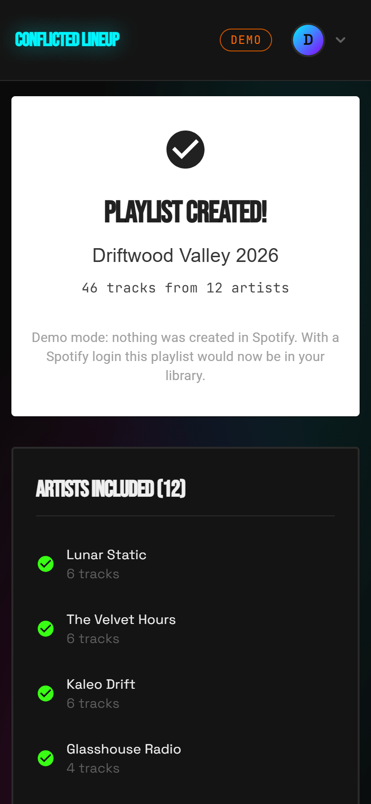
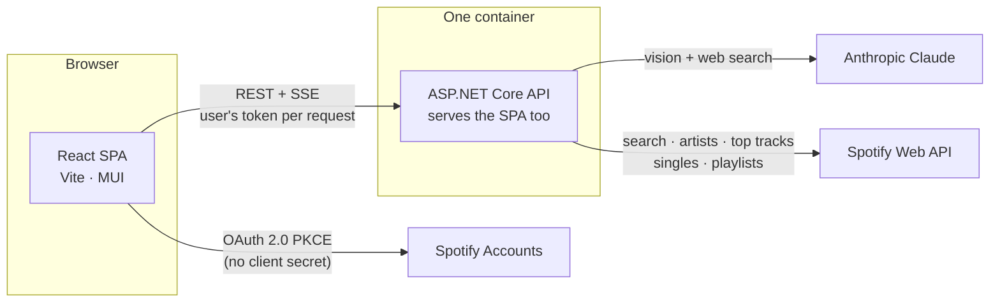

# Conflicted Lineup

[](https://github.com/dylanleatham/ConflictedLineup/actions/workflows/ci.yml)
[](LICENSE)

**Turn any festival lineup into a Spotify playlist.** Type a festival's name or upload its poster;
Claude finds the lineup, the app resolves every act on Spotify, picks tracks weighted by how big
each artist is, and builds the playlist in your account, headliners first.



I built it for friends heading to festivals, who faced the same chore: forty names on a poster, half
of them unfamiliar, and an evening of searching Spotify one artist at a time. The first version
went from an empty repo to deployed on Azure in four days. It has since been retired, so today
it runs locally, and with [demo mode](#run-it) it needs no API keys or Spotify account.

**C# / .NET 10 · ASP.NET Core · React 18 · TypeScript · Vite · Anthropic Claude API (vision + web
search) · Spotify Web API (OAuth PKCE) · Server-sent events · xUnit · Vitest · Testing Library ·
Docker · GitHub Actions · Azure Container Apps + Front Door (retired)**

---

## How it works

| Step | What happens | What's interesting underneath |
| --- | --- | --- |
| **1. Find the lineup** | Type "Driftwood Valley 2026", or upload the poster. | One prompt serves both paths. With a poster, Claude reads the festival's name from the image, then **searches the web** for the official lineup, because announcement pages spell names correctly and posters are stylized. If the search finds nothing, it falls back to reading the image. It splits `b2b` sets and `x` collabs, and strips `(DJ Set)` and similar suffixes. |
| **2. Fix it up** | Add, rename or remove artists before anything touches Spotify. | Nothing is written to your account until you say so. |
| **3. Select tracks** | A live progress bar shows each artist being matched and fetched. | Names are resolved with a [matcher](backend/src/ConflictedLineup.Api/Services/SpotifySearchService.cs) that rejects Spotify's near misses, so "Hol!" doesn't become "Wooli". Progress streams over **server-sent events**. Every Spotify call goes through one [rate-limit handler](backend/src/ConflictedLineup.Api/Services/SpotifyClientFactory.cs). |
| **4. Create the playlist** | One private playlist, headliners first. | Track counts are [weighted by popularity](#the-allocation-rules), and a collaboration never appears twice. |

<table>
  <tr>
    <td width="50%"></td>
    <td width="50%"></td>
  </tr>
  <tr>
    <td>The lineup Claude found, editable before anything touches Spotify</td>
    <td>Progress streamed from the server as each artist is fetched</td>
  </tr>
  <tr>
    <td></td>
    <td></td>
  </tr>
  <tr>
    <td>Tracks per artist, headliners first</td>
    <td>The result, including the act Spotify couldn't match</td>
  </tr>
</table>

<table>
  <tr>
    <td width="25%"></td>
    <td width="25%"></td>
    <td width="25%"></td>
    <td width="25%"></td>
  </tr>
</table>

The screenshots use demo mode's fictional festival and are regenerated by
[`frontend/scripts/demo-screenshots.mjs`](frontend/scripts/demo-screenshots.mjs).

## Architecture



- **One container, one origin.** The API serves the built SPA, so there is no CORS. It stores
  nothing: each request carries the user's Spotify token, and the Anthropic key never leaves the
  server. In production it ran on Azure Container Apps behind Front Door, with keyless GitHub → Azure
  deploys over OIDC (the [deploy workflow](https://github.com/dylanleatham/ConflictedLineup/blob/d13b527/.github/workflows/deploy-platform.yml)
  was removed with the Azure resources).
- **Demo mode is a DI swap.** `DEMO_MODE=true` registers fixture implementations of the Claude,
  track-selection and playlist interfaces. Everything else runs for real: controllers, SSE,
  validation, and the [allocation rules](backend/src/ConflictedLineup.Api/Services/PlaylistAllocator.cs).
  The SPA reads `/api/config` at startup and swaps the Spotify login for a demo sign-in.

```
backend/src/ConflictedLineup.Api/   Controllers → services; Demo/ holds the fixture services
backend/tests/                      xUnit: unit tests + the HTTP pipeline via WebApplicationFactory
frontend/src/                       pages/, components/, services/ (API + SSE), auth/, utils/
.planning/                          The research, plans and verification behind each build phase
design/                             Design brief, tokens and the reference mock-up
```

## The allocation rules

A flat "top five per artist" playlist is mostly openers you've never heard of. The
[`PlaylistAllocator`](backend/src/ConflictedLineup.Api/Services/PlaylistAllocator.cs) is a pure
function with its own [tests](backend/tests/ConflictedLineup.Api.Tests/PlaylistAllocatorTests.cs):

- **Budget by popularity.** Spotify popularity 70+ gets 6 tracks, 40-69 gets 4, below 40 gets 2.
- **Top tracks first, then recent singles**, so you hear the hits and what they're touring now.
- **No track twice.** A collaboration shows up in both artists' top tracks. Artists claim tracks
  from least to most popular, so the smaller act keeps the collab: the headliner has plenty of
  other hits, and the opener may not. In the demo, "Afterglow" goes to Tiny Comet, not Lunar Static.
- **Headliners first** in the finished playlist; an artist left with no unclaimed tracks is omitted.

## Engineering notes

- **Streaming progress without racing the response.** Track selection reports progress from
  whatever thread its awaits resume on, but a response body can have only one writer. Progress goes
  into a `Channel<T>` that the request drains in order, so events never interleave and `complete`
  is always the last event ([controller](backend/src/ConflictedLineup.Api/Controllers/TrackSelectionController.cs)).
  The client reads the stream with a small [async generator](frontend/src/services/sse.ts) that
  copes with events split across network chunks. `EventSource` can't POST.
- **Rate limits handled in one place.** Spotify's development mode is strict, and a big lineup is
  hundreds of calls. A single `IRetryHandler` honours `Retry-After`, but fails fast when Spotify
  asks for a multi-hour back-off rather than holding the request open. Calls are paced, artist and
  album lookups are batched 50 and 20 at a time, and lineups over 50 artists skip recent singles.
  A client disconnect cancels the remaining calls.
- **Claude's reply is parsed defensively, on purpose.** Structured outputs would guarantee the
  JSON shape, but they can't be combined with citations, and web search results always carry them.
  So the [parser](backend/src/ConflictedLineup.Api/Services/LineupResponseParser.cs) finds the
  object across several text blocks, prose and code fences, and the tests pin both the parsing and
  the exact request sent to the API, via a fake HTTP handler.
- **Least privilege.** The Spotify sign-in asks for exactly two scopes (profile name, create a
  private playlist) and creates playlists as private. See [SECURITY.md](SECURITY.md) for the threat
  model and the one known gap.
- **Tested and gated.** 53 backend tests (xUnit, including the HTTP pipeline end-to-end in demo mode)
  and 20 frontend tests (Vitest + Testing Library). CI runs them with lint, typecheck, a production
  build and a Docker build on every push. `npm audit` reports zero advisories, and warnings are
  errors in the C# build.

## How it was built

This was also an experiment in building quickly with an AI coding agent without losing control of
the design.

- **Research before code.** [Stack, feature, architecture and pitfall research](.planning/research)
  came first. It flagged the constraint that shaped everything later: Spotify's development mode
  caps an app at 25 users and a strict rate limit, and extended access is effectively unavailable to
  small apps. So this was built as a friends-only tool from day one.
- **Five phases, each shipped.** Deploy a skeleton, then Spotify auth, lineup extraction, track
  selection, and playlist creation. Each phase has its context, research, plans, summaries and
  verification under [`.planning/phases`](.planning/phases), and each ended deployed. v1 took four
  days: 5 phases, 21 plans.
- **A deliberate visual redesign.** Once v1 worked, a [design brief](design/DESIGN_BRIEF.md)
  ("Portal to the Undercard": nocturnal, neon-on-black, like something handed out at a bass
  festival at 3am) and a [token set](design/tokens.css) (Bebas Neue, Space Grotesk, cyan and magenta
  glows) replaced the generic first UI.

### What went wrong, and what it taught me

- **The "familiar tracks" feature didn't survive the rate limit.** The plan was to open each
  artist's section with songs already in your library. Scanning a library means paging through
  saved tracks and your playlists, which multiplied the calls per run and kept hitting development
  mode's rate limit. Cutting the scan from 500 tracks and 50 playlists to 100 and 10 wasn't enough,
  so it was [switched off](https://github.com/dylanleatham/ConflictedLineup/commit/66ae776) and
  later removed. The lesson: budget API quota per feature at design time.
- **Blank screen after a path change.** Vite's `BASE_URL` ends in a slash; React Router's
  `basename` must not. Every route matched nothing and rendered nothing
  ([fix](https://github.com/dylanleatham/ConflictedLineup/commit/3c01104)).
- **405 on every API call.** Hosted under `/conflicted`, ASP.NET Core's minimal hosting put
  routing *before* `UsePathBase`, so controller routes never matched and the SPA fallback answered
  every POST ([fix](https://github.com/dylanleatham/ConflictedLineup/commit/a720bb4)). Middleware
  order is behaviour; call `UseRouting()` explicitly.
- **A .NET version merry-go-round.** The first deploys bounced between .NET 9, 8 and 10 in one
  evening, chasing a package conflict with the Claude SDK, which targeted .NET 10
  ([resolved](https://github.com/dylanleatham/ConflictedLineup/commit/cf942eb)). Moving to a single
  container later ended that class of problem, because the runtime ships with the app.
- **Found in review before going public:** the SSE endpoint wrote progress from fire-and-forget
  `async void` callbacks, which can interleave with the final event. Six services each had their
  own copy of the retry loop, and some calls were retried twice over. Both fixes are
  [here](https://github.com/dylanleatham/ConflictedLineup/commit/df77479).

## Run it

### Demo mode (no keys needed)

Requires Docker:

```bash
docker compose up --build
```

Open http://localhost:8080 and choose **Try the demo**. Or without Docker (needs the .NET 10 SDK
and Node 22):

```bash
cd frontend && npm install && cd ..
./dev.sh --demo            # or .\dev.ps1 -Demo on Windows; open http://localhost:5175
```

### With Claude and Spotify

1. Create an app in the [Spotify developer dashboard](https://developer.spotify.com/dashboard), add
   `http://127.0.0.1:5175/callback` (dev) and/or `http://127.0.0.1:8080/callback` (Docker) as
   redirect URIs, and add your account under *User Management*.
2. Put `VITE_SPOTIFY_CLIENT_ID` in `frontend/.env.local` and `ANTHROPIC_API_KEY` in `backend/.env`
   (see the `.env.example` files).
3. Run `./dev.sh`, or `DEMO_MODE=false docker compose up --build` with both values in a root `.env`.

### Tests

```bash
dotnet test                                  # backend, from the repo root
cd frontend && npm test && npm run lint      # frontend
```

## License

[MIT](LICENSE). Not affiliated with or endorsed by Spotify or Anthropic. All artists, tracks and
festivals in demo mode are fictional.
